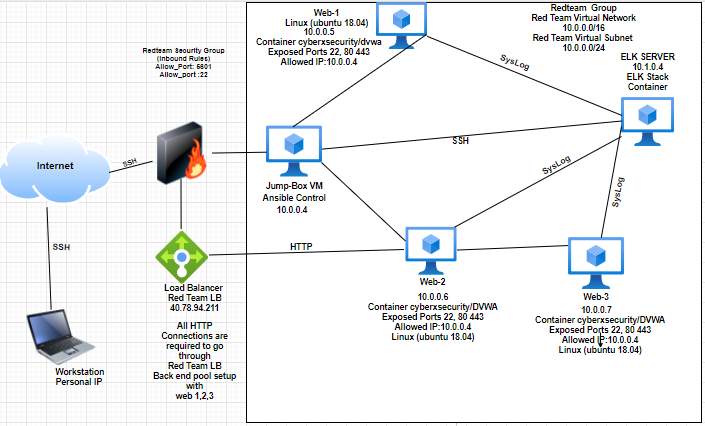

Automated ELK Stack Deployment

The files in this repository were used to configure the network depicted below.

These files have been tested and used to generate a live ELK deployment on Azure. They can be used to either recreate the entire deployment pictured above. Alternatively, select portions of the .yml file may be used to install only certain pieces of it, such as Filebeat.

The ansible-playbooks elk.yml and the filebeat-playbook.yml are needed to create and implement the Elk-Server.

This document contains the following details:

Description of the Topology
Access Policies
ELK Configuration
Beats in Use
Machines Being Monitored
How to Use the Ansible Build

Description of the Topology

The main purpose of this network is to expose a load-balanced and monitored instance of DVWA, the D*mn Vulnerable Web Application.

Load balancing ensures that the application will be highly available, in addition to restricting access to the network.

What aspect of security do load balancers protect?
Load Balancing contributes to the Availability aspect of security in regards to the CIA Triad.

What is the advantage of a jump box?
The advantage of a JumpBox is the orgination point for launching Administrative Tasks. This ultimately sets the JumpBox as a SAW (Secure Admin Workstation). All Administrators when conducting any Administrative Task will be required to connect to the JumpBox (SAW) before perfoming any task/assignment.
Integrating an ELK server allows users to easily monitor the vulnerable VMs for changes to the logs and system traffic.

What does Filebeat watch for?
Filebeat watches for log files/locations and collects log events.

What does Metricbeat record?
Metricbeat records metric and statistical data from the operating system and from services running on the server.

The configuration details of each machine may be found below.

Name
IP Address
Usage
OS

JumpBox
10.0.0.4
Ansible
Linux (ubuntu 18.04)

DVWA-VM1
10.0.0.9
Docker-DVWA
Linux (ubuntu 18.04)

DVWA-VM2
10.0.0.10
Docker-DVWA
Linux (ubuntu 18.04)

DVWA-VM3
10.0.0.7
Docker-DVWA
Linux (ubuntu 18.04)

DVWA-VM4
10.0.0.8
Docker-DVWA
Linux (ubuntu 18.04)

ELk-Server
10.0.0.11
Elk
Linux (ubuntu 18.04)

Access Policies
The machines on the internal network are not exposed to the public Internet.
Only the JumpBox machine can accept connections from the Internet. Access to this machine is only allowed from the following IP addresses:
-Personal IP Address
Machines within the network can only be accessed by SSH.

The only machine that is able to connect to the Elk-Server (10.0.0.11) is via JumpBox from Private IP (10.0.0.4)

A summary of the access policies in place can be found in the table below.

Name
Publicly Accessible
Allowed IP Addresses

Jump Box
No
Personal IP Only

DVWA-VM1
No
10.0.0.4

DVWA-VM2
No
10.0.0.4

DVWA-VM3
No
10.0.0.4

DVWA-VM4
No
10.0.0.4

ELk-Server
No
10.0.0.4 & Personal IP

Elk Configuration
Ansible was used to automate configuration of the ELK machine. No configuration was performed manually, which is advantageous because...

The main advantages of automating configuration through Ansible is the ease of use and an extremely easy learning curve. Through the use of Playbooks you are able to configure multiple Machines through the use of a single command after initial configuration.

The playbook implements the following tasks:

Create a New VM (should be named something simple "Elk-Server") Keep note of the Private IP (10.0.0.11) and the Public IP (0.0.0.0) you will need the Private IP to SSH into the VM and the Public IP to connect to the Kibana Portal (HTTP Site) to view all Metrics/Syslogs.
Download and Configure the "elk-docker" container "In the hosts.conf you will need to add a new group [elkservers] and the Private IP (10.0.0.11) to the group. Then you need to create a new ansible-playbook (elk.yml) that will download, install, configures the "Elk-Server" to map the following ports [5601,9200,5044], and starts the container.
Launch and expose the container "After installing and starting the new container. You can verify that the container is up and running by SSHing into the container from your JumpBox (SAW). Once you are in the [Elk-Server] run the command [sudo docker ps]
Create new Inbound Security Rules to allow Ports: 5601 and 9200 "The Inbound Security Rules should allow access from your Personal Network"
Open a new browser and type in the [Public IP:5601] to access the Kibana Portal Site
